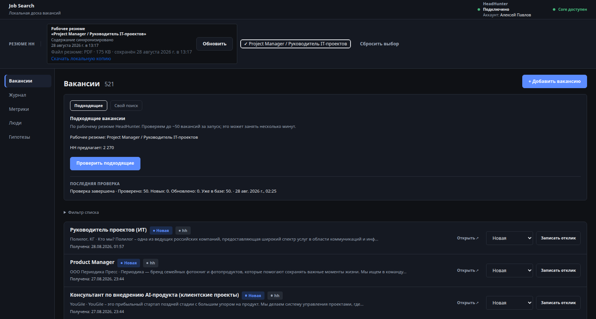
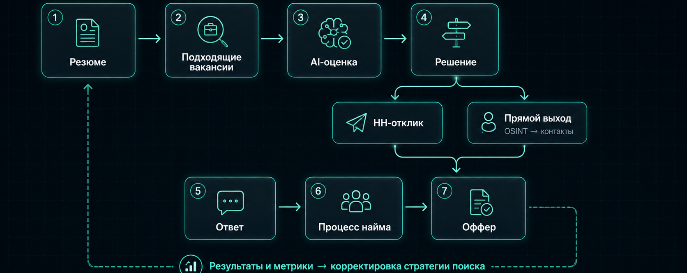
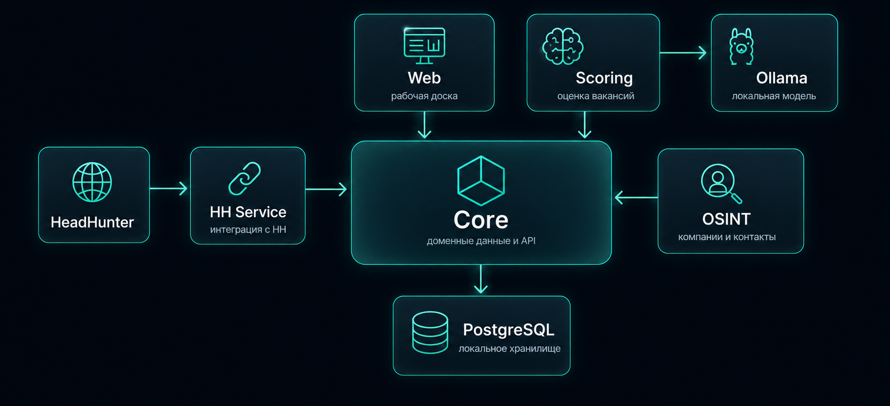

# Job Search

**Local-first AI-система для управления поиском работы: резюме → подходящие вакансии → AI-оценка → решение → отклик → результат.**

Проект родился из собственного поиска работы. Его цель — собрать разрозненный процесс в один управляемый pipeline: подключить HeadHunter, сохранить контекст и версии резюме, собирать и дедуплицировать вакансии, оценивать их локальной LLM и вести историю решений, откликов и результатов.

`Local-first` · `HeadHunter integration` · `Resume-aware scoring` · `Active development`



## Зачем появился Job Search

Когда вакансий становится сотни, поиск работы перестаёт быть задачей «найти и откликнуться». Нужно помнить, каким резюме ты вышел на компанию, какие вакансии уже видел, где откликнулся, что ответили, какие гипотезы сработали и когда пора менять стратегию. В браузерных вкладках, заметках и истории HeadHunter этот контекст быстро распадается.

Job Search я сделал для себя как единый рабочий контур: вакансии, решения, отклики и результаты остаются связаны с конкретной версией резюме и периодом поиска. AI здесь не заменяет решение пользователя — он помогает быстрее разобрать большой поток и выделить то, что стоит внимания.

## Как работает Job Search

Job Search ведёт вакансию через весь путь — от появления в списке до решения, контакта с работодателем, процесса найма и итогового результата.



*Часть этапов уже работает, остальные последовательно реализуются по roadmap.*

## Что умеет Job Search

### ✅ Уже работает

**HeadHunter integration**  
Рабочее резюме синхронизируется локально вместе с его структурированной версией и PDF-копией. Job Search получает HH-нативный список подходящих вакансий для выбранного резюме.

**Vacancy pipeline**  
Вакансии автоматически загружаются, нормализуются и дедуплицируются. Система сохраняет историю получения, отличает новые вакансии от уже известных и формирует единый рабочий список.

**Рабочая доска вакансий**  
Вакансии можно просматривать, фильтровать и переводить между рабочими состояниями. Основные доменные данные хранятся локально в Core/PostgreSQL.

### 🚧 Сейчас в разработке

**Resume-aware AI scoring**  
Каждая вакансия будет оцениваться относительно конкретной версии резюме и scoring policy. Результат — воспроизводимые `score` + `apply / maybe / skip`, а не просто свободный ответ LLM.

Следующий продуктовый результат — массовая оценка и приоритизация списка вакансий.

### 🗺️ Дальше по roadmap

**Выход на работодателя**  
HH-отклик или прямой контакт с компанией.

**OSINT для direct outreach**  
Поиск конкретных людей и контактов запускается пользователем для выбранной вакансии.

**Процесс найма**  
Ответы работодателей, этапы интервью, история взаимодействия и решения.

**Метрики и стратегия**  
Результаты серии откликов, конверсии по этапам и корректировка стратегии поиска.

**Оффер → выход на работу**  
Сравнение офферов, решение и завершение поискового цикла.

## Архитектура



Job Search разбит на независимые сервисы с собственными границами ответственности. Core владеет доменными данными и публичными API-контрактами; интеграции с HeadHunter, AI-scoring и OSINT вынесены в отдельные сервисы. Такая структура позволяет развивать и заменять интеграции независимо друг от друга.

## Tech stack

`Python` · `FastAPI` · `PostgreSQL 17` · `Docker Compose` · `Playwright / Chromium` · `Ollama` · `Vanilla Web`

Сервисы развиваются независимо и общаются через HTTP API; локальные AI-задачи выполняются через Ollama, а browser-based интеграции изолированы в отдельных сервисах.

## Запуск локально

Job Search поднимается локально через Docker Compose.

```bash
git clone --recurse-submodules https://github.com/craz/job-search-workspace.git
cd job-search-workspace
make bootstrap
make up
```

После старта Web доступен по адресу [http://127.0.0.1:8080/](http://127.0.0.1:8080/) (порт по умолчанию из `compose.yaml`; можно переопределить через `WEB_PORT`).

HeadHunter после первого запуска обычно требует начальной авторизации/сессии в сервисе HH. Для AI-scoring нужны локально установленные Ollama и подготовленная модель — без этого доска вакансий всё равно работает, а оценка вакансий — нет.

> **Reproducibility status:** clean-install acceptance на новой машине/VM запланирован как финальный Gate v1. До его прохождения команды выше описывают поддерживаемый development setup, а не гарантированный installer.

## Документация

- [Architecture](ARCHITECTURE_PLAN.md) — границы сервисов и архитектурные решения
- [Implementation plan](IMPLEMENTATION_PLAN.md) — последовательность развития продукта
- [Scoring](services/scoring/README.md) — локальная AI-оценка вакансий через Ollama
- [Design](DESIGN.md) — визуальные правила рабочей доски
- [Contributing](CONTRIBUTING.md) — короткий путь изменений и соглашения по коммитам
